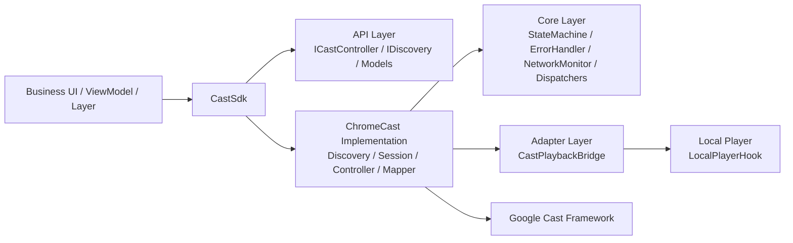
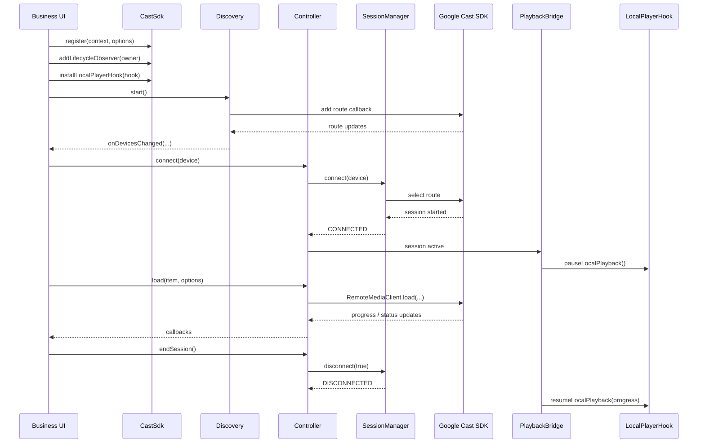
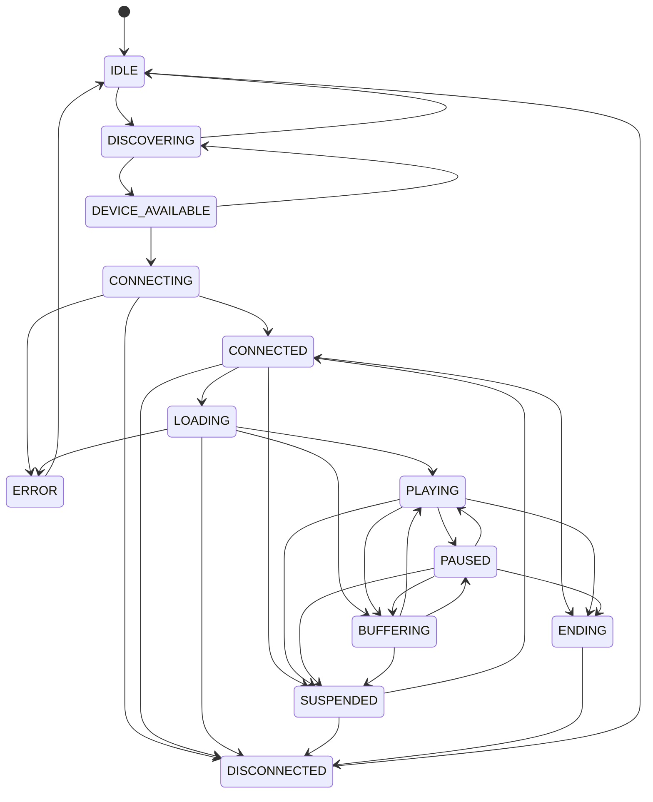

# vod-cast Design

## Overview

`vod-cast` is the casting module used by the Android VideoOne demo. It provides a protocol-agnostic SDK surface for device discovery, session management, remote playback control, local player coordination, and error recovery. The current implementation is backed by Google Cast / ChromeCast, while the public API is designed to keep protocol-specific details out of business code.

## Goals

- Provide a stable cast API for business modules.
- Keep protocol-specific logic inside dedicated implementation packages.
- Centralize state transitions, recovery policy, and network recovery handling.
- Coordinate remote playback with the local player without coupling the SDK to a specific player implementation.
- Offer a lifecycle-aware integration model for discovery and session handling.

## Module Layout

```text
solutions/vod-cast/
├── src/main/java/com/byteplus/vodcast/api
│   ├── CastSdk.kt
│   ├── ICastController.kt
│   ├── IDiscovery.kt
│   ├── CastDevice.kt
│   ├── MediaItem.kt
│   ├── CastSessionState.kt
│   ├── RemoteMediaState.kt
│   ├── LocalPlayerHook.kt
│   └── CastError.kt
├── src/main/java/com/byteplus/vodcast/core
│   ├── StateMachine.kt
│   ├── ErrorHandler.kt
│   ├── NetworkMonitor.kt
│   ├── Dispatchers.kt
│   └── lifecycle/CastLifecycleBinder.kt
├── src/main/java/com/byteplus/vodcast/adapter
│   └── CastPlaybackBridge.kt
└── src/main/java/com/byteplus/vodcast/impl/chromecast
    ├── ChromecastBootstrapper.kt
    ├── ChromecastDiscovery.kt
    ├── ChromecastSessionManager.kt
    ├── ChromecastController.kt
    ├── ChromecastMediaInfoMapper.kt
    └── CastOptionsProvider.kt
```

## Architecture



## Design Principles

### Protocol-agnostic API

Business code talks to `CastSdk`, `ICastController`, and `IDiscovery`. It does not need to know about `MediaRouter`, `CastContext`, `RemoteMediaClient`, or platform-specific device objects.

### Single source of truth for session state

`StateMachine` defines the legal session transitions and shields the business layer from unstable or duplicate platform callbacks.

### Serialized command execution

Control operations such as `connect`, `load`, `seekTo`, `setSpeed`, and `switchQuality` are dispatched on a dedicated cast executor to avoid race conditions.

### Clear separation of responsibilities

- `api/` defines business-facing contracts and models.
- `core/` provides shared runtime behavior.
- `impl/chromecast/` integrates with the Google Cast framework.
- `adapter/` coordinates local player behavior around cast sessions.

### Local player decoupling

`LocalPlayerHook` exposes the minimum local playback operations needed by the cast flow. This keeps `vod-cast` independent from any specific player engine.

## Core Components

### CastSdk

`CastSdk` is the public entry point of the module.

Responsibilities:

- Register the cast implementation.
- Expose `controller()` and `discovery()` accessors.
- Provide lifecycle binding through `addLifecycleObserver(...)`.
- Accept `LocalPlayerHook` injection from business code.
- Store global `CastOptions`.

Important integration rule:

- Call `CastSdk.register(...)` before any UI layer or business object accesses `CastSdk.controller()` or `CastSdk.discovery()`.

### ICastController

`ICastController` is the unified remote playback control surface.

Supported operations:

- `connect`
- `disconnect`
- `load`
- `switchQuality`
- `play`
- `pause`
- `seekTo`
- `setSpeed`
- `setVolume`
- `endSession`

It also exposes listener callbacks for:

- state changes
- progress changes
- error delivery
- selected device changes

### IDiscovery

`IDiscovery` is the device discovery surface.

It supports:

- `start`
- `stop`
- `refresh`
- listener registration
- current device snapshot access

The ChromeCast implementation maintains a stable device snapshot and pushes updates on the main thread.

### StateMachine

`StateMachine` owns the SDK session state. Illegal transitions are rejected and logged instead of being propagated to business code.

Key states:

- `IDLE`
- `DISCOVERING`
- `DEVICE_AVAILABLE`
- `CONNECTING`
- `CONNECTED`
- `LOADING`
- `PLAYING`
- `PAUSED`
- `BUFFERING`
- `SUSPENDED`
- `ENDING`
- `DISCONNECTED`
- `ERROR`

### ErrorHandler

`ErrorHandler` centralizes failure handling and recovery strategy.

Examples:

- connect timeout
- session suspension timeout
- media load retry
- no-network error delivery
- reconnect after network restoration

### NetworkMonitor

`NetworkMonitor` observes network state changes and informs `ErrorHandler` when network access is lost or restored.

### CastPlaybackBridge

`CastPlaybackBridge` coordinates local playback and remote playback.

Behavior:

- pauses local playback when a cast session becomes active
- tracks remote progress
- restores local playback with the latest known remote progress when the cast session ends

## Session Flow



## State Model



## Remote Load Strategy

`ChromecastMediaInfoMapper` converts `MediaItem` and `LoadOptions` into platform load parameters.

Priority rules:

1. Explicit `LoadOptions` values win.
2. `MediaItem` values are used next.
3. `LocalPlayerHook` values are used as fallback where applicable.

Examples:

- start position can come from `LoadOptions.playPositionMs` or `MediaItem.startPositionMs`
- playback speed can come from `LoadOptions.speed`, `MediaItem.speed`, or the local player
- autoplay is adjusted for completed local playback to restart from the beginning on the receiver

## Error Model

Representative error cases:

- `SESSION_START_FAILED`
- `SESSION_SUSPENDED`
- `SESSION_TAKEN_OVER`
- `SESSION_ENDED_BY_RECEIVER`
- `MEDIA_LOAD_FAILED`
- `NETWORK_LOST`
- `NO_NETWORK`
- `DEVICE_UNAVAILABLE`

The error layer distinguishes between recoverable and non-recoverable scenarios and routes them to business listeners through `ICastController.Listener.onError(...)`.

## Usage

### 1. Add the module dependency

Ensure the Android project includes `solutions/vod-cast` and its implementation dependencies.

### 2. Register the SDK early

Recommended:

- register in `Application.onCreate`, or
- register before creating any UI layer that reads `CastSdk.discovery()` or `CastSdk.controller()`

Example:

```kotlin
CastSdk.register(applicationContext, CastOptions.default())
```

### 3. Bind discovery to lifecycle

```kotlin
CastSdk.addLifecycleObserver(viewLifecycleOwner)
```

### 4. Install the local player hook

```kotlin
CastSdk.installLocalPlayerHook(localPlayerHook)
```

### 5. Observe and control casting

```kotlin
val controller = CastSdk.controller()

controller.addListener(object : ICastController.Listener {
    override fun onStateChanged(state: CastSessionState) = Unit

    override fun onProgressChanged(progressMs: Long, durationMs: Long) = Unit

    override fun onError(error: CastError) = Unit
})

controller.connect(device)
controller.load(mediaItem, LoadOptions(playPositionMs = localProgress))
```

## Integration Notes

- `CastSdk.register(...)` must happen before any direct access to `controller()` or `discovery()`.
- Discovery callbacks are delivered on the main thread.
- Control commands are serialized internally and may be invoked from any thread.
- The module is currently implemented with ChromeCast, but business code should rely only on the `api` package.
- `CastPlaybackBridge` should remain the only place that coordinates local pause/resume around cast playback.

## Testing

The module includes unit tests for:

- state transitions
- error handling
- playback bridge behavior
- media load parameter resolution
- network transition decisions

Key test files:

- `solutions/vod-cast/src/test/java/com/byteplus/vodcast/core/StateMachineTest.kt`
- `solutions/vod-cast/src/test/java/com/byteplus/vodcast/core/ErrorHandlerTest.kt`
- `solutions/vod-cast/src/test/java/com/byteplus/vodcast/adapter/CastPlaybackBridgeTest.kt`
- `solutions/vod-cast/src/test/java/com/byteplus/vodcast/impl/chromecast/ChromecastMediaInfoMapperTest.kt`
- `solutions/vod-cast/src/test/java/com/byteplus/vodcast/core/NetworkMonitorTest.kt`

## Future Extension

The current public API leaves room for additional cast protocols in the future. New protocol implementations should be added under `impl/` while keeping the `api/` and `core/` packages stable for business integrations.
